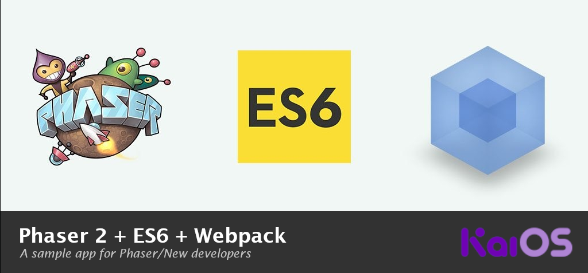

# Phaser 3 + ES6 + Webpack.
#### A sample app to create games with Phaser 3 + ES6 + Webpack for the KaiOS platform.



### Phaser 2 supported in this branch: [Phaser 2 Sample App](https://github.com/kaiostech/phaser-sample-app/)

## Features
- ESLINT with JavaScript Standard Style configuration
- Next-generation of Javascript
- Browsers are automatically updated as you change project files
- Webpack ready
- WebFont Loader
- Multi-language support
- PWA Support

## Plugins
- KaiAds

# Setup
You'll need to install a few things before you have a working copy of the project.

## 1. Clone this repo:

Navigate into your workspace directory.

Run:

```git clone -b phaser3 https://github.com/kaiostech/phaser-sample-app.git```

## 2. Install node.js and npm:

https://nodejs.org/en/


## 3. Install dependencies ([Yarn](https://yarnpkg.com/) is also available!):

Navigate to the cloned repo's directory.

Run:

```npm install``` 

or if you chose yarn, just run ```yarn```

## 4. Run the development server:

Run:

```npm start```

This will run a server so you can run the game in a browser. It will also start a watch process, so you can change the source and the process will recompile and refresh the browser automatically.

To run the game, open your browser and enter http://localhost:3000/ into the address bar.


## Build for deployment:

Run:

```npm run build```

This will optimize and minimize the compiled bundle.

## Run for testing:

Run:

```npm run test```

This will identify and point out all the errors of coding style.


## Config:
Before you get to work you will surely want to check the config file. You could setup dimensions, webfonts, etc.


## Webfonts:
In the config file, you can specify which webfonts you want to include. In case you do not want to use webfonts simply leave the array empty.


## Run the app on a KaiOS device

Follow [OS ENV Setup](https://developer.kaiostech.com/getting-started/env-setup/os-env-setup) and [Test your apps](https://developer.kaiostech.com/getting-started/build-your-first-package-app/test-your-apps)
install in your device.


## Contributors

- Peter Wu  
https://github.com/kaiostech


## Support

Email: <a href="mailto:developersupport@kaiostech.com">developersupport@kaiostech.com</a>